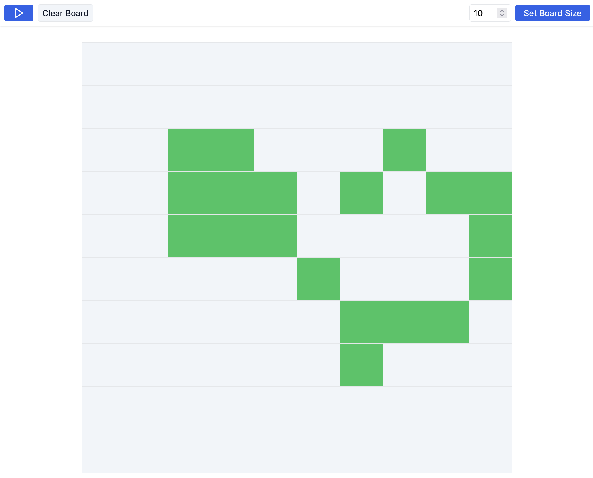

# ConwayReact
Conway's Game of Life in React

## Run Instructions
1. Install dependencies with your package manager of choice, (npm, pnpm, yarn, bun, etc...)
2. Run the `dev` script. (`npm run dev`, `bun run dev`, etc...)

## About
This is an implementation of Conway's game of life in React. Read about the game [here](https://en.wikipedia.org/wiki/Conway%27s_Game_of_Life).

### Interact
Click on a tile in the grid to toggle it's state. (Alive <---> Dead).

### Play/Pause
In the upper left, there is a play/pause button. By default, the game is paused, so you can set your initial game state.

Click play to start the simulation.

### Clear
Click "Clear Board" to set every cell back to a blank (dead) state.

### Board size
In the upper right, you can adjust the size of the board. You can pick a size from 1 to 20. Not sure why you'd want to pick a size of 1 since the cell will immediately die, but you can!
